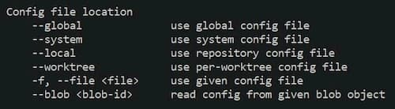

# Table of Content

* [Branch](#branch)
  + [Rename Branch](#rename-branch)
* [Config](#config)
  + [Config Files](#config-files)
    - [Windows](#windows)
  + [Display Configuration Properties and Values](#display-configuration-properties-and-values)
  + [Set or Update Properties](#set-or-update-properties)
    - [Examples](#examples)
* [Credentials](#credentials)
  + [Storage](#storage)
    - [File](#file)
* [Pull](#pull)
  + [Allow pulling unrelated history from remote branch](#allow-pulling-unrelated-history-from-remote-branch)
* [Remote](#remote)
  + [Add remote repo](#add-remote-repo)

<br>

# Quick Commands

|Command|Description|
|:--:|:--:|
|`git restore <file>`|Remove file from untracked|
<br>


## Branch

### Rename Branch

````bash
git branch -m [old branch name] [new branch name]
````

<br><br>

## Config

### Config Files

#### Windows

- Global Path:  `/c/user/username/.gitconfig`
- Local Path:  `./` (root of the project)

<br>

### Display Configuration Properties and Values

```bash
git config --list
```

<br>

### Set or Update Properties

```bash
git config [config file location] [property] [value]		
```

Example
```
git config --local user.email username@company.com
```

- `[config file location]`

  

- `[property]`

  - Property can be seem with `git config --list`
  - Ex.  `user.name`, `user.email`, `remote-origin-url`, etc

- `[value]`

  - Ex. `'value'`

<br>

#### Examples

Setting or Updating Global Name 

```bash
git config --global user.name 'first-name last-name'
```

Setting or Updating Global Email

```bash
git config --global user.email 'my-new-email@company.com'
```


<br><br>

## Credentials

### Storage

#### File

- Description
  - The “store” mode saves the credentials to a plain-text file on disk, and they never expire. This means that until you change your password for the Git host, you won’t ever have to type in your credentials again. The downside of this approach is that your passwords are stored in cleartext in a plain file in your home directory.  [Source](https://git-scm.com/book/en/v2/Git-Tools-Credential-Storage)
- Resources
  - [Git Documentation](https://git-scm.com/book/en/v2/Git-Tools-Credential-Storage)
- Set the file that will be used to store the credentials
  - `git config --global credential.helper 'store --file ~/.gitcredentials'`

<br><br>

## Pull

### Allow pulling unrelated history from remote branch

```bash
git pull [remote name] [branch name] --allow-unrelated-histories
```


<br><br>


## Remote

### Add remote repo

**Prerequisite**

- Git needs to be initialized.

```bash
git remote add [remote name] [repo url] 
```

- `[remote name]` 
  - Can be any name.  
  - By convention it is called `origin`

